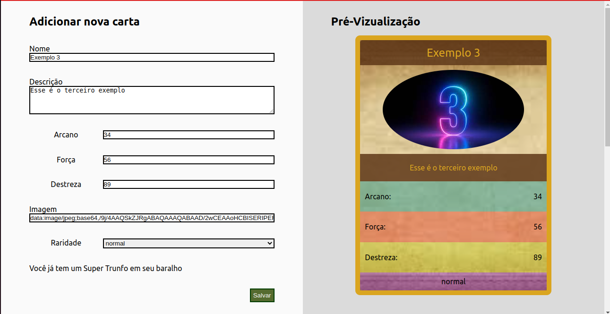
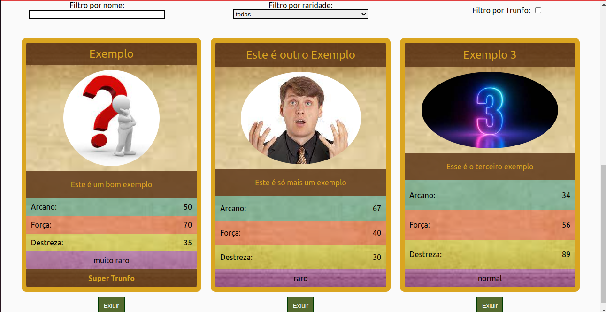

# Projeto 09 - Tryunfo

Oi. Este foi um dos projetos que eu fiz durante meu curso na Trybe. Confira os detalhes dele abaixo.

## Nome do Projeto
Tryunfo (Carrinho de Compras)
## Linguagens e Ferramentas Utilizadas

 - JavaScript
 - HTML
 - CSS
 - [Biblioteca React](https://pt-br.reactjs.org/)

## Objetivos do Projeto
Neste projeto foi desenvolvido uma aplicação que permite a pessoa usuária criar uma carta, no estilo das cartas do popular jogo "Trunfo". Além disso, as cartas criadas ficam salvas, e podem ser filtradas pela pessoa usuária. O intuito do projeto foi aplicar os conhecimentos adquiridos acerca dos componentes com estado e eventos, do React, e também a manipulação de formulários com a biblioteca.

## Instruções para visualização
Comando para clonar o projeto:
 - `git clone git@github.com:BrunoSayago/projeto-09-Tryunfo.git`
 
Se necessário, instalar as dependências:
 - `npm install`
  
O projeto pode ser visualizado no navegador utilizando o comando:
- `npm start`
